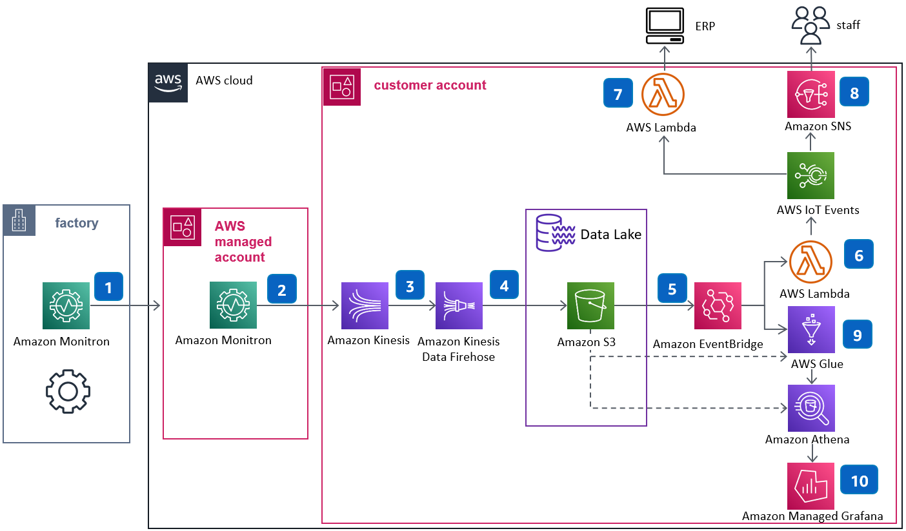

# Context Infrastructure (Terraform IaC)

Thư mục này chứa Terraform để dựng hạ tầng ngữ cảnh theo sơ đồ bạn cung cấp:

1. Monitron (factory) -> Monitron (AWS managed account)  
2. Monitron ingest -> Kinesis Data Streams  
3. Kinesis Data Streams -> Kinesis Data Firehose  
4. Firehose -> S3 Data Lake  
5. S3/Event luồng sự kiện -> EventBridge  
6. EventBridge -> Lambda (xử lý cảnh báo)  
7. EventBridge -> Lambda (forward sang ERP)  
8. Lambda cảnh báo -> SNS  
9. Glue crawler + Data Catalog cho dữ liệu trong S3  
10. Athena + Managed Grafana để phân tích/quan sát

## Sơ đồ kiến trúc

Ảnh kiến trúc được đặt trong thư mục `context_infra/picture`:



## Thành phần được tạo

- `aws_kinesis_stream` cho telemetry ingest
- `aws_kinesis_firehose_delivery_stream` đẩy dữ liệu vào S3 data lake
- `aws_s3_bucket` làm data lake (kèm versioning, encryption, block public access)
- `aws_cloudwatch_event_rule` + targets để route event qua Lambda
- `aws_lambda_function`:
  - `erp_forwarder` (placeholder tích hợp ERP)
  - `alert_notifier` (publish SNS)
- `aws_sns_topic` + email subscription (tùy chọn)
- `aws_glue_catalog_database` + `aws_glue_crawler`
- `aws_athena_workgroup`
- `aws_grafana_workspace` (tùy chọn, bật bằng biến)

## Cách dùng

```bash
cd context_infra
cp terraform.tfvars.example terraform.tfvars
# Chỉnh lại data_lake_bucket_name cho unique toàn cục
terraform init
terraform plan
terraform apply
```

## Lưu ý triển khai thực tế

- Monitron managed account trong sơ đồ là account/service managed; Terraform ở đây triển khai phần hạ tầng trong customer account.
- `EventBridge` hiện dùng pattern mẫu `source=custom.iot.events`. Hãy đổi `event_pattern` cho đúng nguồn sự kiện Monitron/IoT thực tế của bạn.
- `enable_managed_grafana = true` cần điều kiện account đã bật IAM Identity Center và đủ quyền tạo Amazon Managed Grafana.
